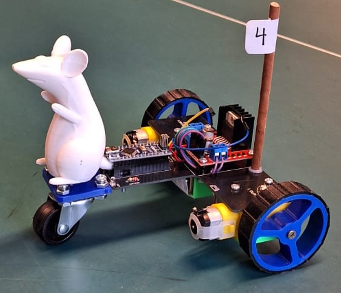
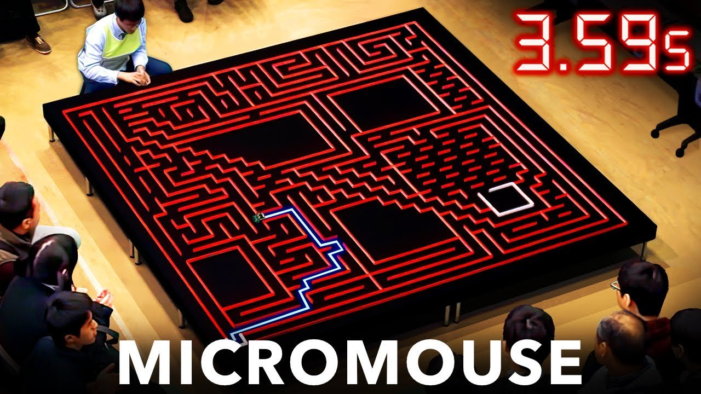
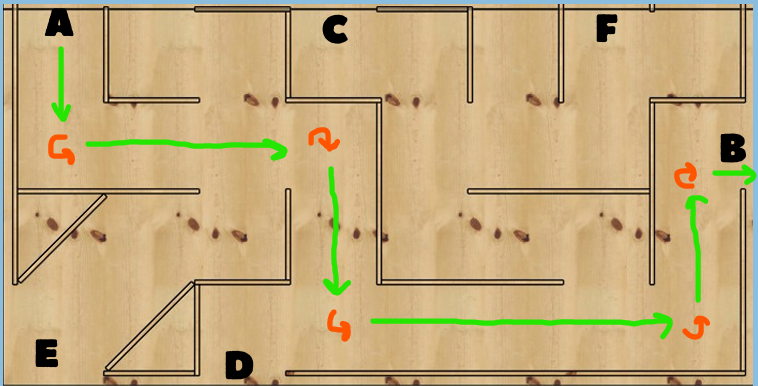
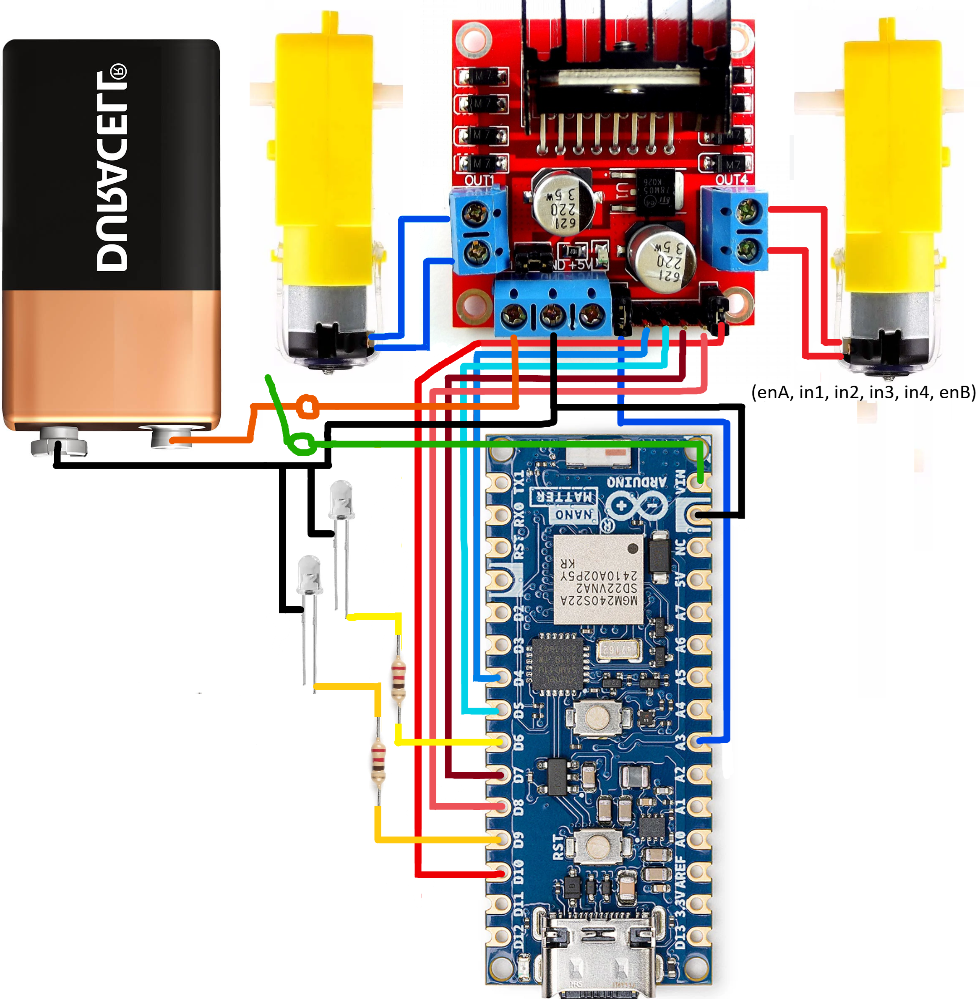

# Desafío 1 – Ratmóvil 

## Registro de Desafio Completado
https://github.com/user-attachments/assets/1001ea79-b7e6-4f0a-bb56-878048dfb4f4
> [!NOTE]
> Este es un video antiguo, en la versión final si se encienden los leds blancos.

## Información del Equipo

- **Equipo:** M0-V
- **Integrantes:**  
  - Felipe Neira  
  - Antonia Reijnst  
  - Carlos Cornejo  
  - Carolina Inostroza  
  - Julio Gamboa  

- **Profesor de Cátedra:** Harold Valenzuela  
- **Profesor Auxiliar:** Francisco Cáceres V. / Fernando Navarrete U.  
- **Ayudante:** Valentina Abarca G.

---

## Introducción

En este desafío se plantea el desarrollo de un sistema de control abierto de motores DC mediante el microcontrolador ARDUINO, con el fin de guiar el movimiento de un vehículo a lo largo de una ruta establecida.  

**Objetivo:**  
Desarrollar y validar un código que siga un trayecto predeterminado, además de indicar el inicio y fin del recorrido mediante 2 leds integrados en la PCB.
**Importancia:**  
Este desafío integra aspectos de básicos hardware y software, siendo un primer paso en la eventual implementación de un sistema de control de lazo cerrado, una versión mas sofisticada de esta idea puede verse en el siguiente video (click en la imagen para ver)

---

## Metodología

### Problema Técnico

El reto consistió en lograr un control preciso del vehículo, dividiendo el trayecto en secciones que faciliten la programación y validación de cada parte (tramos de conducción recta y giros).

### Enfoque Utilizado

- **Segmentación del Trayecto:** Dividir la ruta en seis tramos de conducción recta y cinco giros para facilitar el control preciso.
- **Control Modular:** Desarrollo de funciones independientes que permitan gestionar cada tramo.

### Herramientas y Materiales

- **Hardware:**  
  -Microcontrolador Arduino Nano
  -Módulo controlador de motores L298N H-bridge
  -2x Motorreductor DC y par de ruedas
  -batería de 9 V

- **Software:**  
  - Arduino IDE

---

## Desarrollo

### Hardware

**Diagrama y Esquemas de Conexión:**  

## Caracterización de PWM ##

---

## Pruebas y Validación

### Procedimientos

Se realizaron pruebas en entorno controlado para verificar:

- Precisión en la ejecución de tramos y giros.
- Estabilidad y desempeño del sistema en condiciones reales.

### Problemas Encontrados y Soluciones

- **Conexiones inestables:**  
  *Solución:* Reemplazo de cables defectuosos y uso de un interruptor para asegurar una conexión confiable.

- **Inconsistencias durante giros:**  
  *Solución:* Ajustes en la programación y mejora en el mecanismo de alineación de la rueda loca.

